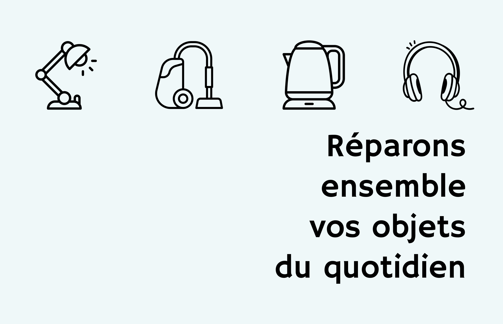

## Infos pratiques

* Tous les 3èmes samedis du mois, de 10h à 13h.
* Au Bô Café du Beau Tiers Lieu, 71 Rue de la Bottière, 44300 Nantes.
* Gratuit et ouvert à toutes et tous!

## Nos objectifs

* Donner une seconde vie aux objets, notamment au petit électroménager.
* Transmettre l'envie et les compétences pour réparer soi-même.
* Donner une seconde vie aux objets, notamment au petit électroménager
* Sensibiliser aux enjeux de la réparabilité.

## Bilan année 2024

* 11 cafés réparations
* 26 adhérents et adhérentes
* 70 visiteurs et visiteuses pour une réparation ou un café
* 60% d'objets réparés

