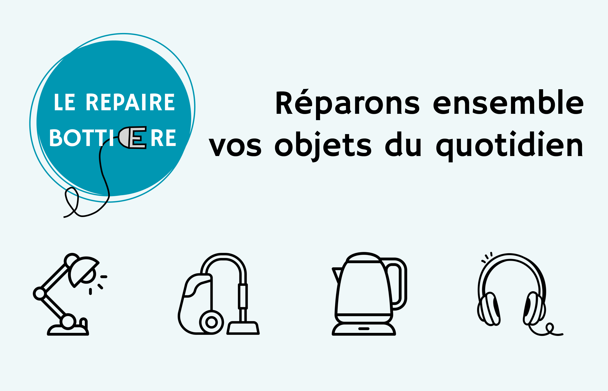

## Infos pratiques

* Tous les 3èmes samedis du mois, de 10h à 13h.
* Au Bô Café du Beau Tiers Lieu, 71 Rue de la Bottière, 44300 Nantes.
* Gratuit et ouvert à toutes et tous!
* Les prochaines dates :
  * Pas de repair café en août!
  * Samedi 20 septembre 2025
  * Samedi 18 octobre 2025
  * Samedi 15 novembre 2025
  * Samedi 13 decembre 2025 (2ème samedi du mois exceptionnellement)
  

<iframe src="https://www.google.com/maps/embed?pb=!1m18!1m12!1m3!1d2708.7912054853578!2d-1.5216272875196017!3d47.24022987103821!2m3!1f0!2f0!3f0!3m2!1i1024!2i768!4f13.1!3m3!1m2!1s0x4805ef069af7e26d%3A0xec7705ec2edb867!2sB%C3%B4%20Caf%C3%A9%20du%20Beau%20Tiers%20Lieu!5e0!3m2!1sfr!2sfr!4v1740662508238!5m2!1sfr!2sfr" width="400" height="300" style="border:0;" allowfullscreen="" loading="lazy" referrerpolicy="no-referrer-when-downgrade"></iframe>

## Nos objectifs

* S'implanter dans la Bottière.
* Soutenir le pouvoir d'achat de nos usagers.ères
* Transmettre l'envie et les compétences pour réparer soi-même.
* Donner une seconde vie aux objets, notamment au petit électroménager.
* Sensibiliser aux enjeux de la réparabilité.

## Bilan année 2024

* 11 cafés réparations
* 26 adhérents et adhérentes
* 70 visiteurs et visiteuses pour une réparation ou un café
* 60% d'objets réparés, principalement du petit électroménager.

## Nos partenaires

* [BeauTiersLieu](https://www.beautierslieu.fr/)
* [Ecossolies](https://www.ecossolies.fr/)
* [Fondation International Repair Café](https://www.repaircafe.org/fr/)
* [HOP](https://www.halteobsolescence.org/) - Halte à l'Obsolescence programmée
* [Ville de Nantes](https://metropole.nantes.fr/)

## Contact 

Nous serons ravis de vous lire, écrivez nous à <lerepaire44@gmail.com>.

<!-- Removing "This page was generated by GitHub Pages." -->
 